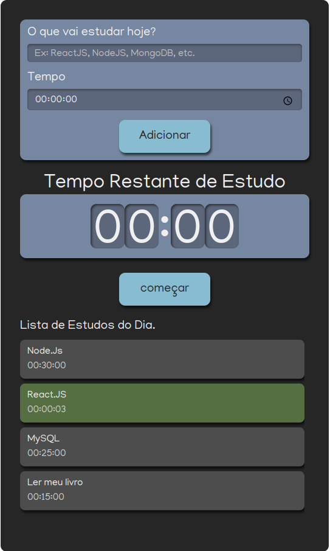

<h1 align="center"><a href="https://listadeestudos.vercel.app/"> 💻 Projeto</a></h1>

Projeto desenvolvido com intuito de ter controle dos meus Estudos.

  <a href="#-tecnologias">Tecnologias</a>&nbsp;&nbsp;&nbsp;|&nbsp;&nbsp;&nbsp;
  <a href="#-projeto">Projeto</a>&nbsp;&nbsp;&nbsp;|&nbsp;&nbsp;&nbsp;
  <a href="#memo-licença">Licença</a>

  

 

  

## 🚀 Tecnologias

Esse projeto foi desenvolvido com as seguintes tecnologias:

- [React.JS](https://pt-br.reactjs.org/) 
- [Create a New React App](https://reactjs.org/docs/create-a-new-react-app.html)
- [TypeScript](https://www.typescriptlang.org/)
- [Node e NPM](https://nodejs.org/)
- [SASS](https://sass-lang.com/)
- [uuid v4](https://www.uuidgenerator.net/version4)

## 💻 Projeto

O projeto, O que vai Estudar hoje?, é um componente que simula um formulário de preenchimento com cronômetro de Estudos , onde é possível adicionar tempo aos seus estudos (matérias).

## :memo: Licença

Esse projeto está sob a licença MIT.

---

Feito por Vitor Augusto [Me sigua no Linkedlin](https://www.linkedin.com/in/viitoraugusto/)

