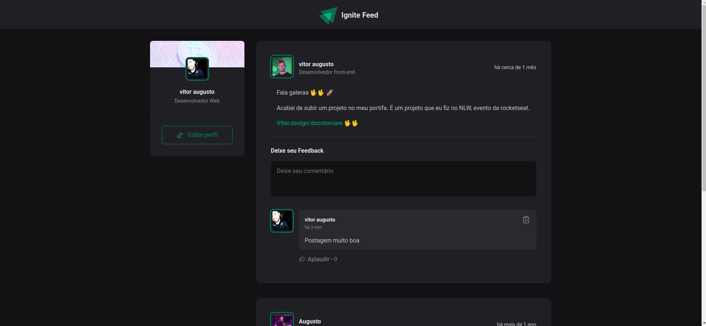

<h1 align="center"><a href="https://feedignite-nine.vercel.app/"> 💻 Projeto Ignite Feed</a></h1>

Projeto desenvolvido com propósito de um rede sociais.

  <a href="#-tecnologias">Tecnologias</a>&nbsp;&nbsp;&nbsp;|&nbsp;&nbsp;&nbsp;
  <a href="#-projeto">Projeto</a>&nbsp;&nbsp;&nbsp;|&nbsp;&nbsp;&nbsp;
  <a href="#memo-licença">Licença</a>

  

 

  

## 🚀 Tecnologias

Esse projeto foi desenvolvido com as seguintes tecnologias:

- [React.JS](https://pt-br.reactjs.org/) 
- [Vite](https://vitejs.dev/)
- [TypeScript](https://www.typescriptlang.org/)
- [Node e NPM](https://nodejs.org/)
- [CSS](https://developer.mozilla.org/pt-BR/docs/Web/CSS)
- [phosphoricons](https://phosphoricons.com/)
- [date-fns](https://date-fns.org/)
 
    

## 💻 Projeto

O projeto, Ignite Feed é, um projeto inicial focado nos fundamentos do ReactJS, construído com Vite. Principais conceitos do React como componentes, estado, propriedades, imutabilidade, programação declarativa, hooks, CSS Modules e TypeScript.

## :memo: Licença

Esse projeto está sob a licença MIT.

---

Feito por Vitor Augusto [Me sigua no Linkedlin](https://www.linkedin.com/in/viitoraugusto/)

