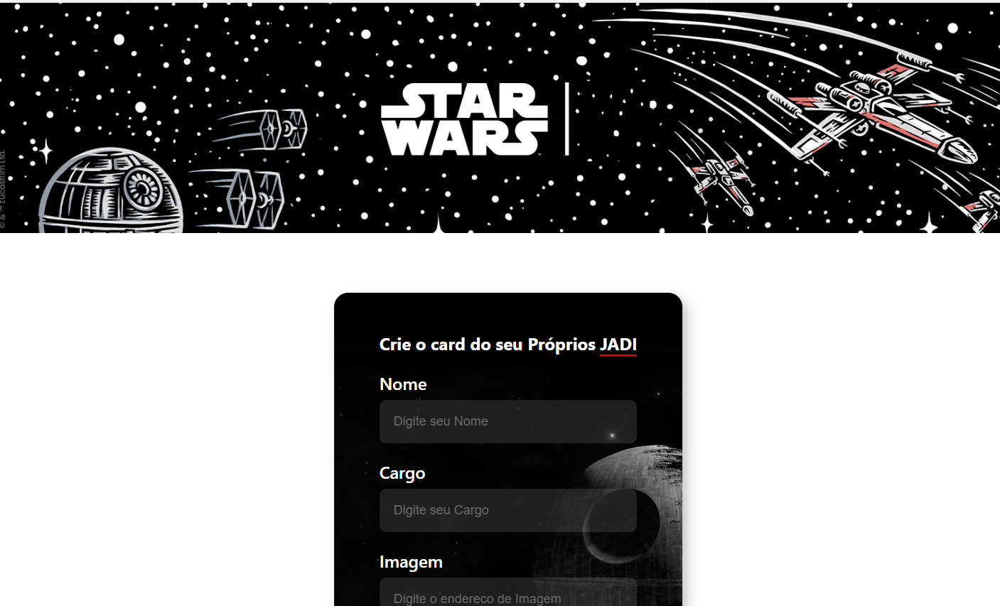
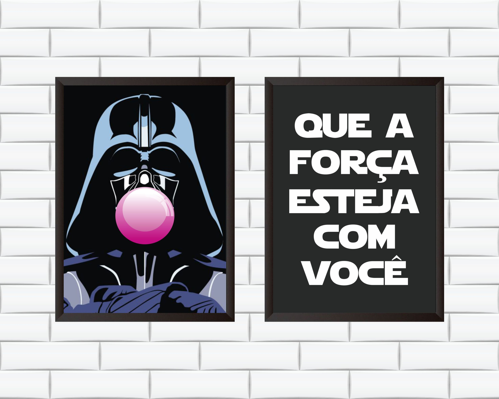

<h1 align="center"><a href="https://starwarscards.vercel.app/"> 💻 Projeto Star Wars</a></h1>

Projeto Star Wars Card. “Que a Força esteja com você”  para ensino de tecnologias WEB.

  <a href="#-tecnologias">Tecnologias</a>&nbsp;&nbsp;&nbsp;|&nbsp;&nbsp;&nbsp;
  <a href="#-projeto">Projeto</a>&nbsp;&nbsp;&nbsp;|&nbsp;&nbsp;&nbsp;
  <a href="#memo-licença">Licença</a>
  

  

 

  

## 🚀 Tecnologias

Esse projeto foi desenvolvido com as seguintes tecnologias:

- [React.JS](https://pt-br.reactjs.org/) 
- [create-react-app](https://create-react-app.dev/)
- [JavaScript](https://developer.mozilla.org/pt-BR/docs/Web/JavaScript)
- [Node e NPM](https://nodejs.org/)
- [CSS](https://developer.mozilla.org/pt-BR/docs/Web/CSS)

## 💻 Projeto

O StarWars é um projeto que simula o formulário de preenchimento de Cards, onde é possível adicionar fotos, nome e cargo aos inputs e atualizar elementos, criando um Card.

## 

  

## :memo: Licença

Esse projeto está sob a licença MIT.

---

Feito por Vitor Augusto [Me sigua no Linkedlin](https://www.linkedin.com/in/viitoraugusto/)
