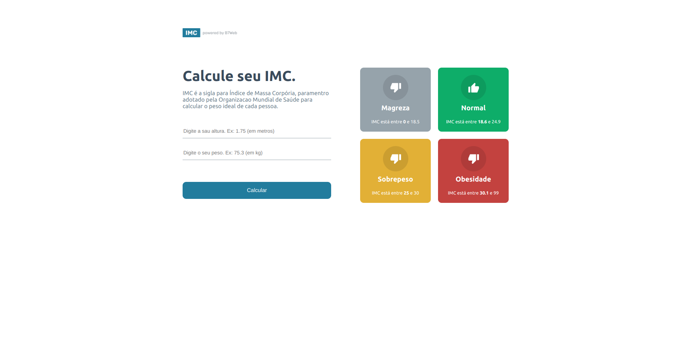
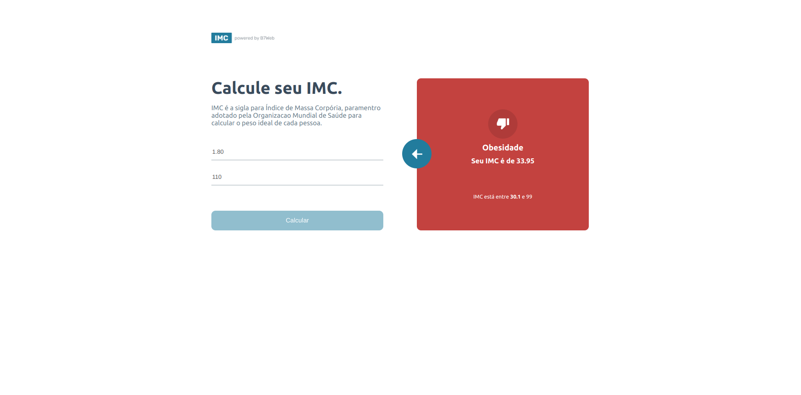

<h1 align="center"><a href="#"> 💻 Calculadora de IMC</a></h1>

<p align="center">
Projeto em React + Typescript fazendo uma calculadora IMC. <br>
Projeto desenolvido duranto o curso B7web
</p>

<p align="center">
  <a href="#-tecnologias">Tecnologias</a>&nbsp;&nbsp;&nbsp;|&nbsp;&nbsp;&nbsp;
  <a href="#-projeto">Projeto</a>&nbsp;&nbsp;&nbsp;|&nbsp;&nbsp;&nbsp;
  <a href="#memo-licença">Licença</a>
  
</p>

<p align="center">
  
</p>

<br>

<p align="center">
  
</p>
<br>
<p align="center">
  
</p>
<br>

## 🛠️ Tecnologias/ Ferramentas

Esse projeto foi desenvolvido com as seguintes tecnologias:

- [TypeScript](https://www.typescriptlang.org/)
- [Node.Js e NPM](https://nodejs.org/)
- [Create React App](https://create-react-app.dev/)


## 📃 Projeto

Calcule seu IMC.
IMC é a sigla para Índice de Massa Corpória, paramentro adotado pela Organizacao Mundial de Saúde para calcular o peso ideal de cada pessoa.


## ⚙️ Como executar 


### Para rodar o projeto


Será necessário que a porta 3000  estejam disponíveis para a aplicação.

1 - Clone o repositório em uma pasta de sua preferencia 
```
https://github.com/ViitorAugusto/Front-End-React
```
2 - Entre na pasta `react_imc`
```
npm install  // todas as depêndencias serão automaticamente instaladas.
```
3 - Use o comando
```
npm start // para inicar a aplicação
```


3 - Após rodar o comando, aguarde um pouco que a aplicação irá ficar disponivel nas seguintes rotas:


  `- http://localhost:3000`

<br>
<br>
<hr>

### 🚀 memo: Licença

Esse projeto está sob a licença MIT.

---

Feito por Vitor Augusto  [ 🌐 Linkedlin.](https://www.linkedin.com/in/viitoraugusto/)


